<div align="center">


<br/>

<p>
  
  
  
  
  
  
  
</p>

[Features](#-features) • [Quick Start](#-quick-start) • [Dashboard](#-dashboard) • [API](#-api)


</div>

---

## 🌟 Overview

FrontDesk AI is a voice-first receptionist that answers common questions and escalates anything tricky to a human supervisor in seconds.

```mermaid
graph LR
    A[📞 Customer] -->|Voice| B[🤖 AI Agent]
    B -->|Knows| C[✅ Instant Response]
    B -->|Needs Help| D[👨‍💼 Supervisor]
    D -->|Guides| B
    B -->|Delivers| A
    
    style A fill:#667eea,stroke:#4f46e5,color:#fff
    style B fill:#f093fb,stroke:#f5576c,color:#fff
    style C fill:#4facfe,stroke:#00f2fe,color:#fff
    style D fill:#43e97b,stroke:#38f9d7,color:#fff
```



---

## ✨ Features

- 🎙️ Natural voice conversations (LiveKit + Gemini)
- 🚀 Instant answers from a built-in knowledge base
- 📈 Dashboard with charts, activity, and recent questions
- 📚 CRUD for knowledge base (add, edit, delete)
- 🔐 Auth with roles: Admin and Supervisor
- 🔔 Escalations with real-time supervisor flow


---

## 🚀 Quick Start

> macOS example shown; adapt paths if different.

```bash
# 1) Clone
git clone https://github.com/mohdrazakhan/FrontDesk_AI_Voice_Assistant.git
cd FrontDesk_AI_Voice_Assistant/frontdesk_project

# 2) Create and activate venv
python3 -m venv venv
source venv/bin/activate

# 3) Install deps
pip install -r requirements.txt

# 4) Configure environment
# If you have an example file, copy it; otherwise create .env manually
# LIVEKIT_URL=...  LIVEKIT_API_KEY=...  LIVEKIT_API_SECRET=...
# GOOGLE_API_KEY=...  FLASK_SECRET_KEY=...

# 5) Initialize database
python database.py

# 6) Run
python app.py            # Dashboard at http://127.0.0.1:5001
python agent.py dev      # In another terminal: start the voice agent
```

Default demo accounts (change after first login):

| Role | Username | Password |
|------|----------|----------|
| 👑 Admin | admin | admin123 |
| 👨‍💼 Supervisor | supervisor | super123 |

---

## 🎨 Dashboard

The web dashboard includes:

- Overview metrics and charts (Chart.js)
- Knowledge Base manager (add/edit/delete)
- Requests with quick answers and bookmarks
- User management for supervisors (Admin)

<div align="center">
  
</div>

---

## 🔌 API

Minimal reference of key endpoints:

| Method | Endpoint | Description |
|--------|----------|-------------|
| POST | `/login` | Login user |
| POST | `/register` | Register supervisor |
| GET | `/logout` | Logout |
| GET | `/check-auth` | Session check |
| GET | `/requests` | List help requests |
| POST | `/answer_request` | Submit answer |
| GET | `/knowledge_base` | List KB entries |
| POST | `/knowledge_base/add` | Add entry |
| PUT | `/knowledge_base/<id>` | Update entry |
| DELETE | `/knowledge_base/<id>` | Delete entry |

---

## 🐛 Troubleshooting

- Port 5001 busy → change `app.run(port=5002)` or free the port.
- DB locked → close SQLite viewers and restart the app.
- Agent not connecting → verify `.env` LiveKit and Google keys.

---

## 📝 License

MIT — free for commercial and personal use.

---

<div align="center">


### Built with ❤️ to make support effortless

If this project helps you, please ⭐ the repo.


</div>
